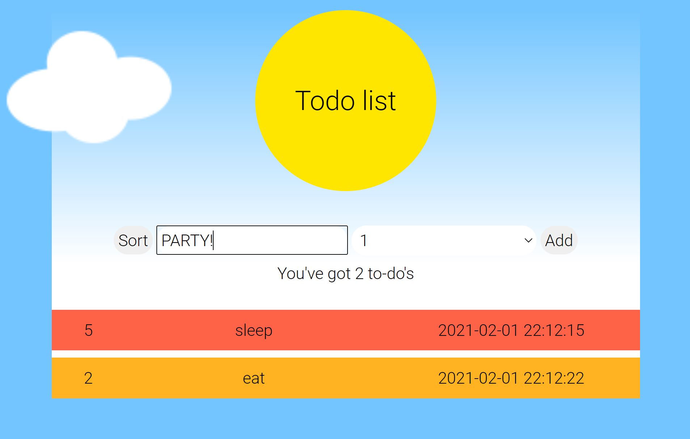

# README pre-course 2021 final 

Hey! 
Welcome to my pre-course FINAL project - *Todo List Web Application*. 🤘
In this web, you can creat a to-do list. just insert your task, choose the numeric priority value of the task, and press the 'Add' button. The list will be ordered from the most importants to the less important tasks by pressing the 'Sort' button.

## Structure

The program is built from 3 main files:
-  - which including the HTML code
-  - including the JavaScript behind the page - all the functions and event listeners. that happens on the page.
The JS file made from 3 parts - setting Variables, event Listners, and functions.
-  - including the style of the page in CSS file.

## How To Use?

Opening the to-do list page will show you an empty to do lists. 
To insert new 'to-do', you have to type any text. the todo wont be add to the list with empty input.
Additionally, the to-do have to get from the user a priority number, else the to-do wond be add to the list.
Each to do will be shown his priority, to-do text and time the mentions the adding to the list time.
Clicking on 'Add' will add the new todo, and clicking on 'Sort' will order the list from the most important tasks (number 5 priority) o the less important tasks (number 1 priority).

## Project Status

Finished project - including all the required elements such as class names, ids, tests requirements, and using the passed month learned materials.

### JavaScript Limitations

The code works well, but got few limitation that important to know:
- No delete for each to-do or the whole list. If you would like to 'clear' your list and make it empty again, you will hava to clear the local storage, or use diferent device.
- You cant mark the to do that you have already done.

Adding this two missiong option is not that complicated, but I decided to ditch those option to focus on the proect tests to work good and the style to stay 'ease'. You welcomed to add those options to the code!

## Local Storage

In the project I used 'local storage' to save my list information, so that on every "refresh" of the page the to-do list that the user creats wont delet, and will be shown on the document.
If the user pressed 'Sort' and then 'Refresh', the order of the list will be as it was before the 'Sort' order happen.

The list is saved in the local storage under the title of 'todo-list'.

## Tests

This project is passing 7 tests from the existing 8 (the failed test is the the bonus one).
To run the build-in tests, type "npm run test" in the _TERMINAL_ at the bottom of the page.
You can see the tests code in the file "final.test.js".

## Style

I wanted to give my list colorful and happy style.
The idea of the rainbow colors came when i thought "how can i make every to-do more intresthing?". After too many houres looking on a screen, I decided to put a lil bit of "sun light" and more happy colors in my to-do list.
The "specialety" of the style, is that for every new to-do, refresh and 'sort' click - the order of the rainbow-colors stays correct and fit himself to every change.

the function *todoColor()* checks what is the to-do item place in the array, and by the rest of hit division with 7 knows to return his color from the 7th rainbow colors.
The returned color sets as class name in the to-do container element.

  FOR EXAMPLE: my list got two "to-do" tasks. first color: red, second color: orange  
                the new and number 3 in the list will get the class name: "yellow"

In my css file, every color-class gets her own background color.

## List of resources:
- https://www.w3schools.com/
- https://developer.mozilla.org/
- https://stackoverflow.com/
- Youtube channels:
  - The Coders
  - Dev Ed
  - Web Dev Simplified

## Autor
- Name :Roni Amir
- Email : roniamir24@gmail.com
- Github : https://github.com/roniamir

Feel comfortable to ask me questions about the project and contect me any time.